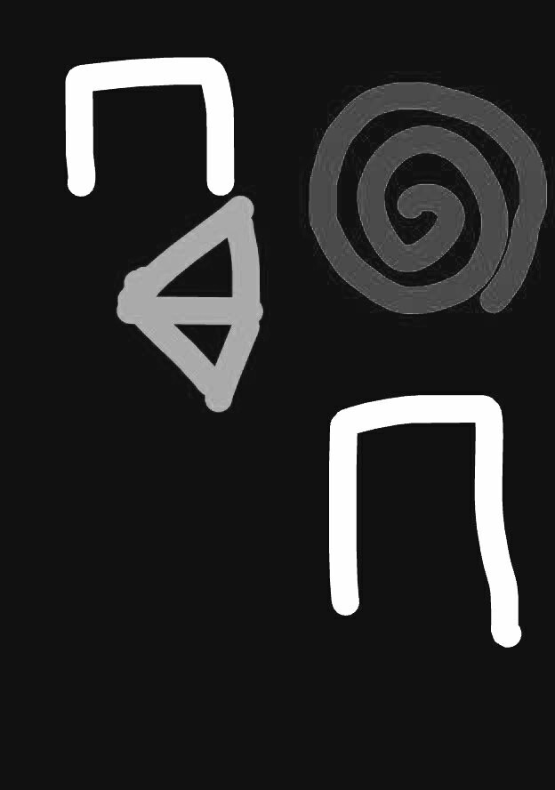
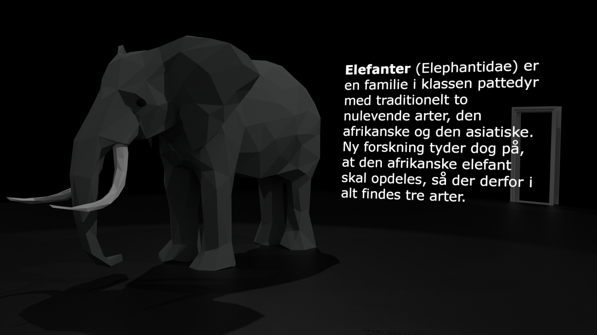
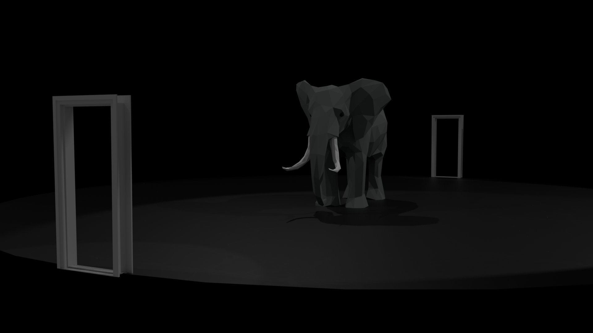
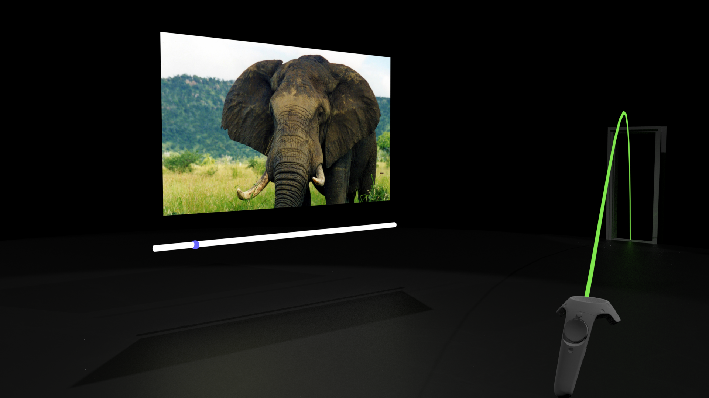

# VRAusstellung

## Ueberlegungen zu museeum/ kunstausstellung

### Rollenverteilung/ Wer
Besucher / Aussteller

#### Aussteller
- waehlt Ausstellungsstuecke aus
- ordnet sie sinnvoll an
- recherchiert sie
- rueckt sie in szene

#### Besucher
- konsumiert Rechercheergebnis
- guckt ausstellungsstuecke an
- bewegt sich durch die gallerie
- recherchiert selbst weiter / rueckt exponat in kontext

### Was ist bei richtigen ausstellungen kool?
- Musik
- Lichtlicht
- Audio-Guide
- Struktur durch Architektur vorgegeben

### Was is nich kool?
Exponate muessen sich Raeume teilen
- andere Menschen
- Exponate sind schlecht beschriftet
- unuebersichtlich
- provisorischer Charakter

### Was stell ich mir vor?
- minimal
- schwarzer Hintergrund
- Dreipunktbeleuchtung
- keine Waende, nur 2 Tuerrahmen (analog zu Raum)
- Texte im HUD
- Exponat hat vieeeel Platz
- Pie-Menu als Nav????
- Exponat links, Nav rechts?
- alle Masse nach modular scale
- alles schwarz/weiss
- AV scrubbing mit dem Touch-Button, minimale Bedienelemente

## Konzept
- Schnoerkellose Ausstellungsflaeche, simple UI, nichts soll vom Exponat ablenken.
- Einfach austauschbare Inhalte ueber Web-UI oder WPF

## Quellen
 - Low Poly Elephant, Matt Beker, https://www.blendswap.com/blends/view/83789

 - Elefanter, https://da.wikipedia.org/wiki/Elefanter

 - Elefant (2).jpg, Caitlin from Hertfordshire UK, https://commons.wikimedia.org/wiki/File:Elefant_(2).jpg

 - Wood Planks 028, Poliigon, https://www.poliigon.com/texture/2271

 - Marble 13, Poliigon, https://www.poliigon.com/texture/1098

 - Fingerprints 004, Poliigon, https://www.poliigon.com/texture/1578
